# generative-models

Train with MNIST and generate hand-written numbers with generative models including VAE, DCGAN and RealNVP.

## Generative Models

The following generative models are included, with configs in `config.ini`:
* VAE (Variational Auto-Encoder) in `vae.py`
* DCGAN (Deep Convolutional Generative Adversarial Networks) in `dcgan.py`
* RealNVP (Real-valued Non-Volume Preserving) in `realnvp.py`

## Prerequisites

* Install the required packages by:
```angular2
pip install -r requirements.txt
```

## Data: MNIST

* Sample

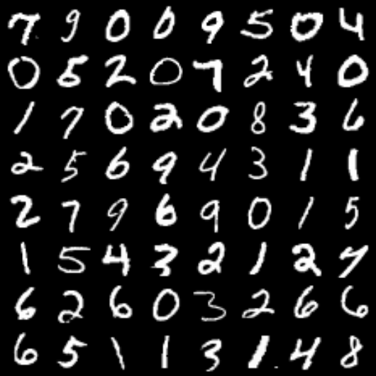

* Dataset

| MNIST | Train |Dev |Test |
| ------| ------|------|------|
| Amount| 48000 |12000 |10000 |

## VAE

### Model

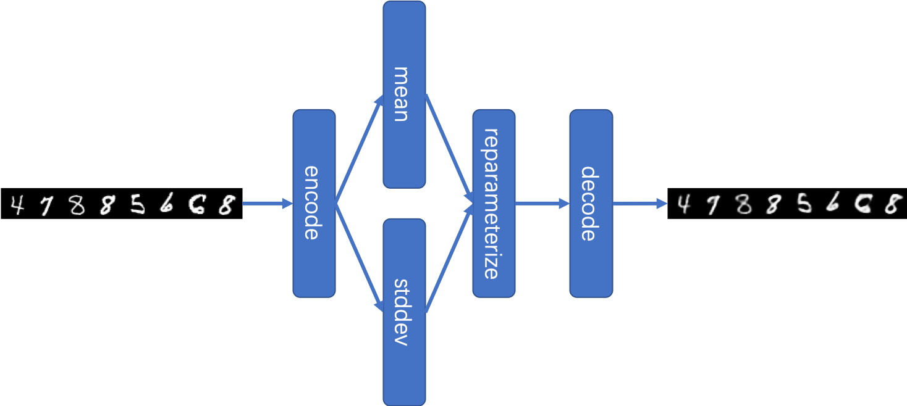

### Command Line

* Run
```commandline
bash run_vae.sh
```

* Log with Tensorboard
```commandline
tensorboard --logdir=log/vae/
```

### Loss

| Train Batch Loss | Train Epoch Loss |
| ------| ------|
| 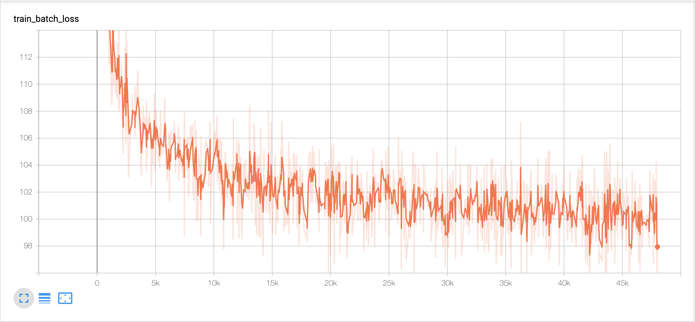 | 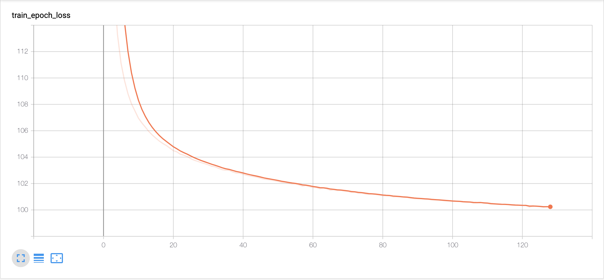 |

| Dev Loss with best epoch 62|Test Loss |
| ------|------|
| 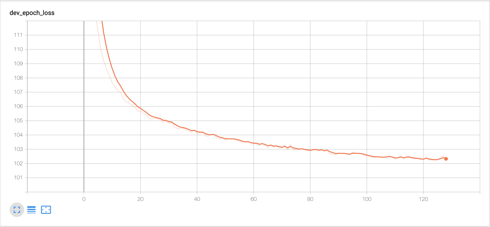 |102.0952 |

### Reconstructed Result

| Epoch 1 | Epoch 10 |Epoch 20 |
| ------| ------|------|
| 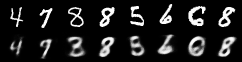| 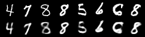|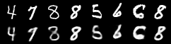 |

| Epoch 30 | Epoch 40 |Epoch 50 |
| ------| ------|------|
| | |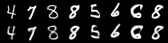 |

| Epoch 64 | Test Result |
| ------| ------|
| 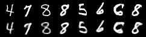| 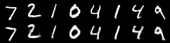|

### Generated Result

| Epoch 1 | Epoch 10 |Epoch 20 |
| ------| ------|------|
| 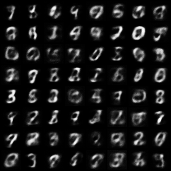| 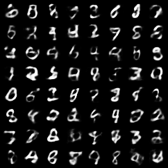|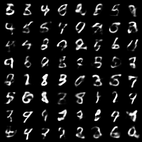 |

| Epoch 30 | Epoch 40 |Epoch 50 |
| ------| ------|------|
| 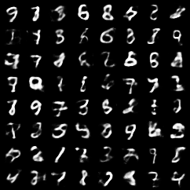| 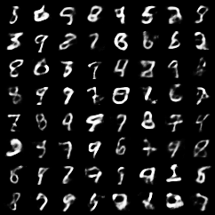|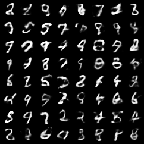 |

| Epoch 64 |
| ------|
| 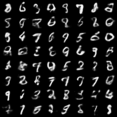|

### Reference

[Auto-Encoding Variational Bayes](https://arxiv.org/abs/1312.6114)

### Link

VAE in [pytorch/examples](https://github.com/pytorch/examples)

## DCGAN

### Model

```
Generator(
  (main): Sequential(
    (0): ConvTranspose2d(100, 512, kernel_size=(4, 4), stride=(1, 1), bias=False)
    (1): BatchNorm2d(512, eps=1e-05, momentum=0.1, affine=True, track_running_stats=True)
    (2): ReLU(inplace)
    (3): ConvTranspose2d(512, 256, kernel_size=(4, 4), stride=(2, 2), padding=(1, 1), bias=False)
    (4): BatchNorm2d(256, eps=1e-05, momentum=0.1, affine=True, track_running_stats=True)
    (5): ReLU(inplace)
    (6): ConvTranspose2d(256, 128, kernel_size=(4, 4), stride=(2, 2), padding=(1, 1), bias=False)
    (7): BatchNorm2d(128, eps=1e-05, momentum=0.1, affine=True, track_running_stats=True)
    (8): ReLU(inplace)
    (9): ConvTranspose2d(128, 64, kernel_size=(4, 4), stride=(2, 2), padding=(1, 1), bias=False)
    (10): BatchNorm2d(64, eps=1e-05, momentum=0.1, affine=True, track_running_stats=True)
    (11): ReLU(inplace)
    (12): ConvTranspose2d(64, 1, kernel_size=(4, 4), stride=(2, 2), padding=(1, 1), bias=False)
    (13): Tanh()
  )
)
```

```
Discriminator(
  (main): Sequential(
    (0): Conv2d(1, 64, kernel_size=(4, 4), stride=(2, 2), padding=(1, 1), bias=False)
    (1): LeakyReLU(negative_slope=0.2, inplace)
    (2): Conv2d(64, 128, kernel_size=(4, 4), stride=(2, 2), padding=(1, 1), bias=False)
    (3): BatchNorm2d(128, eps=1e-05, momentum=0.1, affine=True, track_running_stats=True)
    (4): LeakyReLU(negative_slope=0.2, inplace)
    (5): Conv2d(128, 256, kernel_size=(4, 4), stride=(2, 2), padding=(1, 1), bias=False)
    (6): BatchNorm2d(256, eps=1e-05, momentum=0.1, affine=True, track_running_stats=True)
    (7): LeakyReLU(negative_slope=0.2, inplace)
    (8): Conv2d(256, 512, kernel_size=(4, 4), stride=(2, 2), padding=(1, 1), bias=False)
    (9): BatchNorm2d(512, eps=1e-05, momentum=0.1, affine=True, track_running_stats=True)
    (10): LeakyReLU(negative_slope=0.2, inplace)
    (11): Conv2d(512, 1, kernel_size=(4, 4), stride=(1, 1), bias=False)
    (12): Sigmoid()
  )
)
```

### Command Line

* Run
```commandline
bash run_dcgan.sh
```

* Log with Tensorboard
```commandline
tensorboard --logdir=log/dcgan/
```

### Generated Result

| Epoch 1 | Epoch 10 |Epoch 20 |
| ------| ------|------|
| 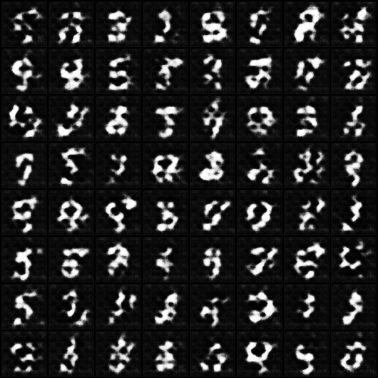| |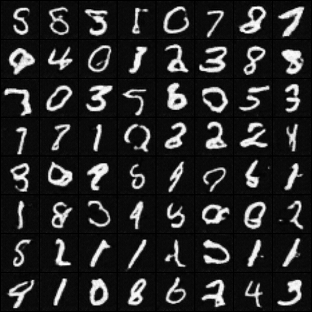 |

| Epoch 30 | Epoch 40 |Epoch 50 |
| ------| ------|------|
| 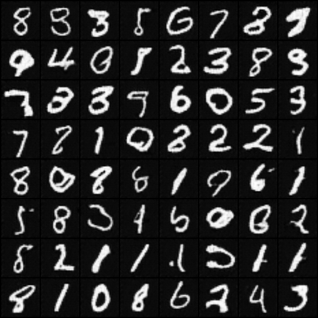| 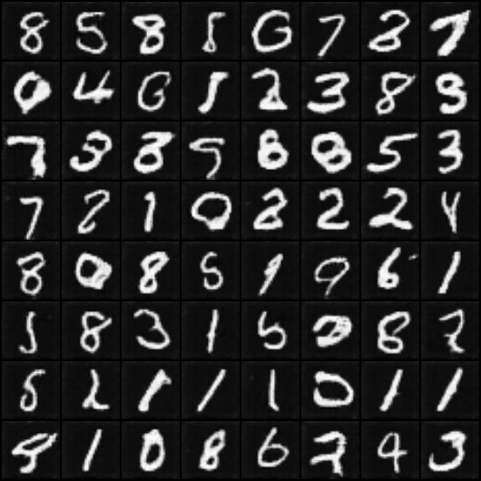|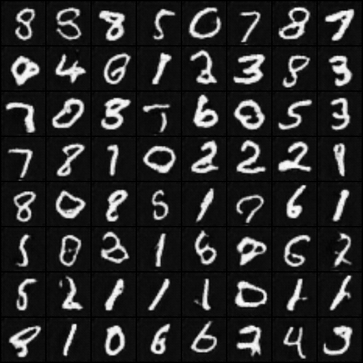|

| Epoch 64 |
| ------|
| 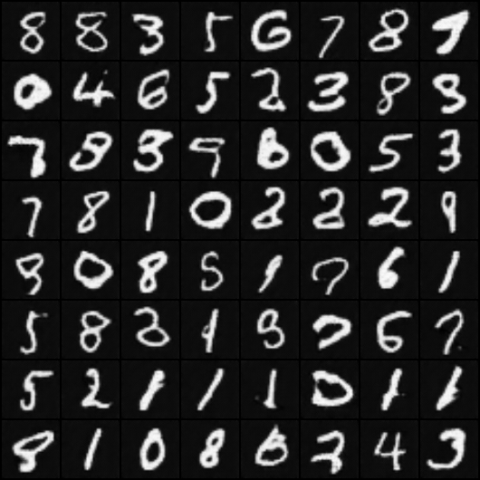|

### Reference

* [Generative Adversarial Networks](https://arxiv.org/abs/1406.2661)
* [Unsupervised Representation Learning with Deep Convolutional Generative Adversarial Networks](https://arxiv.org/abs/1511.06434)

### Link

DCGAN in [pytorch/examples](https://github.com/pytorch/examples)

## RealNVP

### Command Line

* Run
```commandline
bash run_realnvp.sh
```

* Log with Tensorboard
```commandline
tensorboard --logdir=log/realnvp/
```

### Reference

[Density Estimation using Real NVP](https://arxiv.org/pdf/1605.08803.pdf)

### Link

* RealNVP in [ikostrikov/pytorch-flows](https://github.com/ikostrikov/pytorch-flows)
* RealNVP in [kamenbliznashki/normalizing_flows](https://github.com/kamenbliznashki/normalizing_flows)

## Related Lectures

* [uvadlc/uvadlc_practicals_2019](https://github.com/uvadlc/uvadlc_practicals_2019) Assignment 3
* [cs231n/cs231n.github.io](https://github.com/cs231n/cs231n.github.io) Assignment 3, 2019

## Author

Zhongyu Chen
